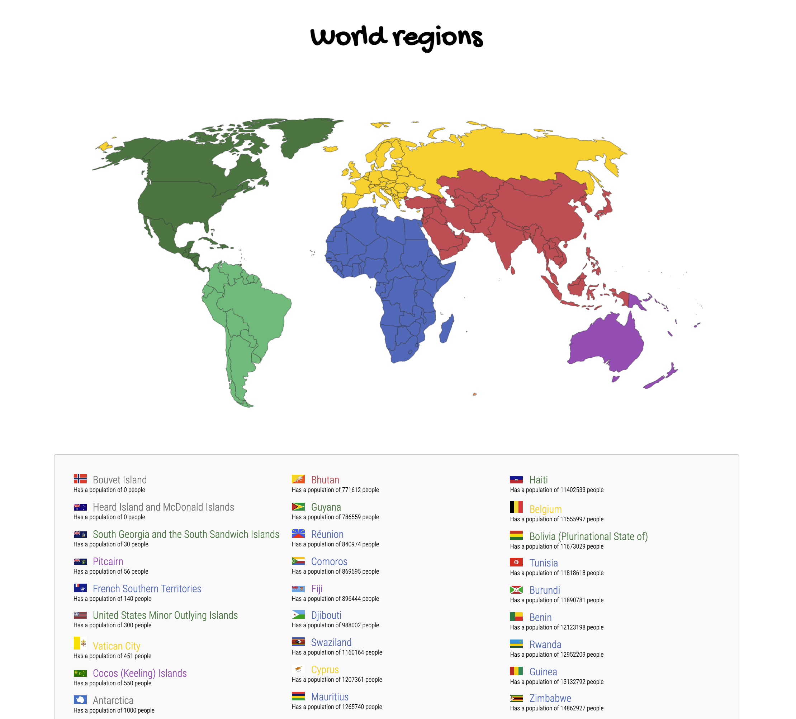

# Opdrachtbeschrijving

## Inleiding

Je vrienden hebben er inmiddels lucht van gekregen dat je kunt programmeren en sindsdien wordt je low key gestalkt met
verzoekjes om webapplicaties te bouwen. Je vriend Constantijn wil heel graag dat je een applicatie voor hem maakt die
feitjes over landen kan ophalen, zodat hij cool kan doen met zijn wereldse kennis op borrels en verjaardagen.



Je gaat dit doen met behulp van de REST Counties API. De documentatie over de verschillende endpoints kun
je [hier](https://restcountries.com/#api-endpoints-v2-all) vinden. Bekijk deze documentatie goed. _Let op:_ we raden je
aan om gebruik te maken van de endpoints uit versie 2 (versie 3 is nog niet zo betrouwbaar).

## Voor je begint

1. Het bestaande CSS- en JavaScript bestand zijn nog niet gekoppeld aan het HTML-bestand. Dit mag je zelf doen.
2. Schrijf voor alle opdrachten eerst **stap voor stap de psuedo-code uit**. Begin dan pas met programmeren. Ik meen
   het.
3. NPM en Parcel zijn al geconfigureerd, maar je moet de bijbehorende dependencies nog wel _installeren_.
   De `node_modules` map wordt immers niet meegepusht naar GitHub. Omdat er een `package.json` aanwezig is in het
   bestand, kun je dit doen met het volgende (globale) commando:

```shell
npm install
```

Alle benodigde dependencies zijn nu binnengehaald! Als je de applicatie wil starten, doe je dat met het volgende
commando:

```shell
npm run start
```

_Tip_: wanneer je gebruik gaat maken van Axios zul je dit nog wel los moeten installeren, want deze staat nog niet in
de `package.json`.

## Randvoorwaarden

* Op basis van de informatie uit de REST Countries API, haal je data op over _alle_ landen ter wereld en geef je deze in
  een lijst weer op de pagina;
* Bovenaan de pagina staat de afbeelding van een wereldkaart (zie de map `assets`);
* Voor ieder land geef je het volgende weer:
    1. De naam van het land
    2. De vlag van dat land
    3. De zin: `Has a population of [amount] people`
* De landen zijn gesorteert op populatie, van laag naar hoog;
* De land-namen moeten worden weergegeven in een kleur die overeenkomt met het continent waar het land in ligt. _Tip_:
  maak hier een aparte functie voor die een regio-naam verwacht en bepaalt welke kleur het land moet krijgen. Een land
  ligt meestal in één van de volgende vijf contintenten, maar uitzonderingen kunnen voorkomen:
    * `Africa`: blauw
    * `Americas`: groen
    * `Asia`: rood
    * `Europe`: geel
    * `Oceania`: paars

## Stappenplan

_Let op_: het is uitdagender om jouw eigen stappenplan te maken. Als je niet zo goed weet waar je moet beginnen, kun je
onderstaand stappenplan gebruiken:

1. Installeer en importeer Axios;
2. Neem de documentatie van de REST Countries API goed door. Welk endpoint heb je nodig om informatie over alle landen
   op te halen?
3. Schrijf een asynchrone functie die, met behulp van Axios, een GET-request maakt naar het juiste endpoint. Log de
   response in de console en bestudeer de data goed: hoe is het opgebouwd?
4. Probeer eens om de _naam_ van het _allereerste_ land te loggen in de console, welk pad moet je hiervoor volgen?
5. Maak een `<ul>`-tag in de HTML die je als referentie kunt gebruiken in jouw JavaScript bestand;
6. Zorg ervoor dat de naam van het allereerste land wordt weergegeven als `<li>`-tag in het lijst-element op de pagina;
7. Zorg er nu ook voor dat de populatie (`Has a population of [amount] people`) daaronder wordt weergegeven;
8. Schrijf een aparte functie die één regio-naam verwacht, en op basis van deze regio de correcte kleur-naam als string
   teruggeeft. Gebruik deze, om de naam van het land in de juiste kleur weer te geven op de pagina. _Tip_: zorg ervoor
   dat je CSS-classes maakt voor alle regio-kleuren!
9. Breidt de `<li>`-tag uit met een ``-tag om zo ook de url van de meegegeven vlag-afbeelding weer te kunnen geven;
10. Gebruik de `map`-methode om over de array met landen heen te mappen, en zo een `<li>`-element te maken voor álle
    landen;
11. Zorg er ten slotte voor dat je de response data eerst sorteert op populatie, van laag naar hoog, voor je eroverheen
    mapt om de landen op de pagina weer te geven.

**Bonusopdrachten**
- Lees paragraaf 8.2 op EdHub door en kijk hoe je dit kunt toepassen in deze opdracht;
- Make it look nice! 😍# novi-frontend-javascript-country-information-prt1-hw-10
